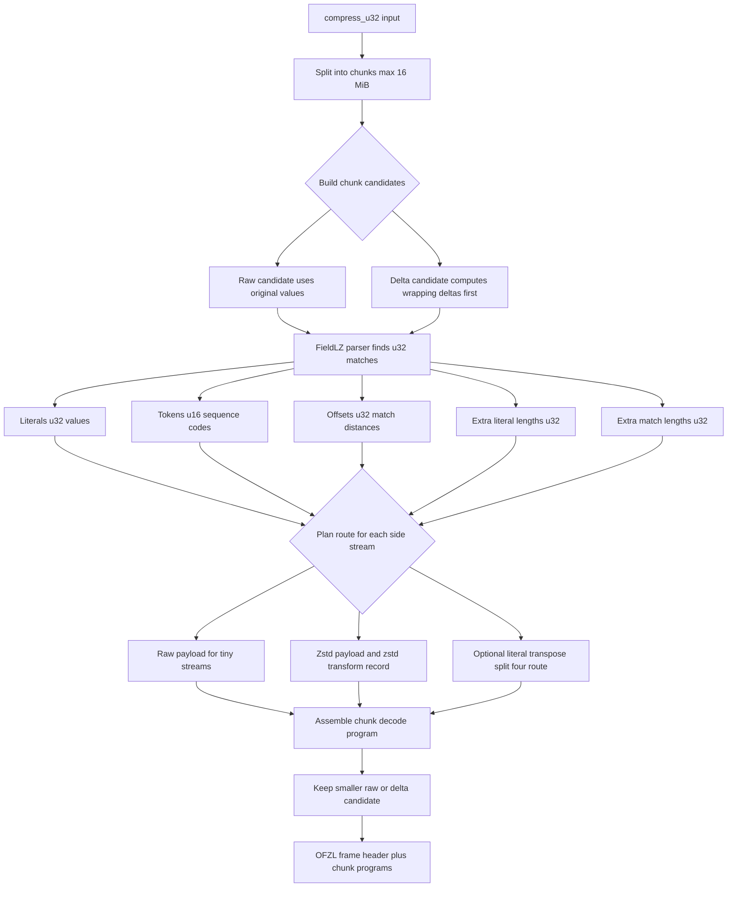
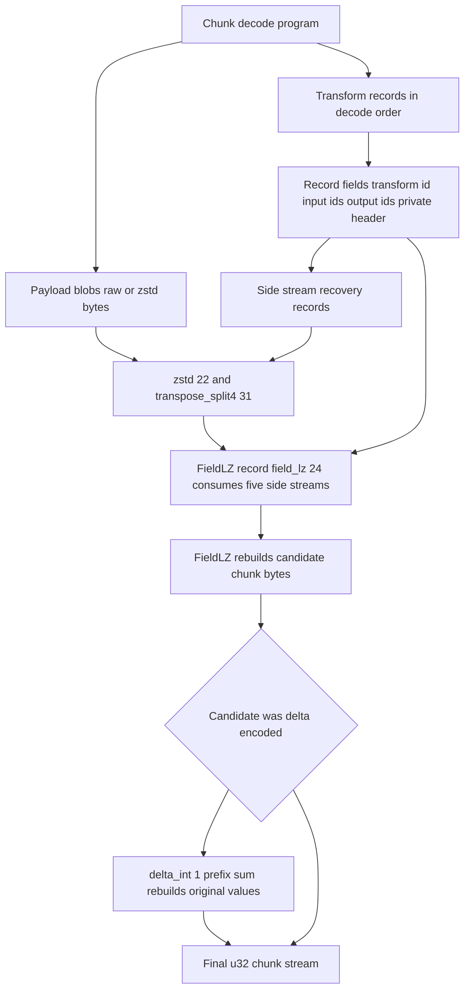

# How the `open_flexzl` compressor works

This document describes the compressor as implemented today and calls out the
planned OpenZL-parity work. Labels used below:

- **Current**: implemented in the crate now.
- **Planned**: tracked by the format/design but not implemented yet.
- **Current foundation / planned extension**: the wire format or decoder already
  leaves room for the feature, but the encoder does not emit it yet.

## One-line summary

**Current:** `compress_u32()` turns a `&[u32]` into an `OFZL` v1 frame by
splitting the input into chunks, parsing each chunk with FieldLZ into five side
streams, compressing each side stream with either raw store or magicless zstd,
and writing a chunk-local transform map that tells the decoder how to rebuild the
original values.

**Planned:** keep the same outer frame/map shape while adding better side-stream
routes such as byte-transposed literals, quantized offsets/lengths, and
FSE/Huffman/bitpack-style entropy codecs.

## Pipeline diagrams

The compressor has two separate concerns: choose and serialize a chunk encoding,
then describe how the decoder must replay that encoding. The first diagram is
the compression path; the second is the decode program that the compressor writes.

### Compression path



### Chunk decode program written by the compressor



The important idea is that compression writes a small decode program for each
chunk. Delta is a compression-time candidate choice: the encoder computes
wrapping deltas before FieldLZ parsing. If that candidate wins, the decode
program later recovers side-stream bytes, runs `field_lz` to rebuild the delta
bytes, then runs `delta_int` to prefix-sum those deltas back to the original
values. The transform records are the central structure: they name the transform,
which stream slots it reads and writes, and any private header bytes needed by
that transform. Payload blobs are just backing bytes for the program.

## Public API

**Current:** the crate exposes two profile-specific functions:

```rust
let frame = open_flexzl::compress_u32(&values)?;
let values = open_flexzl::decompress_u32(&frame)?;
```

The only supported input type is `u32`. Values are serialized internally as
canonical little-endian 4-byte elements.

**Planned:** add options and possibly other fixed-width integer profiles later,
while keeping hot parser paths monomorphized by field width.

## Frame shape

**Current:** every compressed output is an `OFZL` v1 frame:

```text
OFZL header
  magic/version/kind
  final output metadata: numeric, width 4, total element count
  chunk count
  chunks...
```

Each non-empty frame contains one or more chunks. Chunks are capped at 16 MiB of
source bytes, which is 4,194,304 `u32` values. Empty input is encoded as a header
with `chunk_count = 0`.

**Current foundation / planned extension:** each chunk contains a compact decode
map rather than a fixed list of blobs:

```text
chunk metadata
stored byte streams
transform records in decode order
final stream id
```

A transform record names a standard transform ID, its input stream IDs, output
stream IDs, and private header bytes. This is intentionally OpenZL-like, but the
outer frame is native to this crate and is not OpenZL-frame-compatible.

Supported transform IDs today:

| ID | Transform | State | Role |
| --- | --- | --- | --- |
| `1` | `delta_int` | Current | Optional post-FieldLZ prefix-sum decode for delta-coded chunks. |
| `22` | `zstd` | Current | Decompresses a stored magicless zstd side stream. |
| `24` | `field_lz` | Current | Rebuilds a chunk from the five FieldLZ side streams. |
| `31` | `transpose_split4` | Current | Recombines four literal byte lanes into a width-4 literal stream. |

## Compression pipeline

### 1. Chunk the input

**Current:** `compress_u32()` splits the source slice into independent chunks of
at most `MAX_CHUNK_ELEMENTS_U32`. Chunk history does not cross boundaries.

```text
[u32 values]
  -> chunk 0
  -> chunk 1
  -> ...
```

This bounds FieldLZ offsets and lets the decoder validate every chunk
independently.

### 2. Build candidate chunk encodings

**Current:** for each chunk, the encoder always builds a raw FieldLZ candidate:

```text
original u32 values -> FieldLZ parser -> side streams -> chunk graph
```

It may also build a delta candidate when cheap chunk statistics suggest it could
win:

```text
original u32 values
  -> wrapping deltas
  -> FieldLZ parser over deltas
  -> side streams
  -> FieldLZ decode stream
  -> delta_int transform back to original values
```

The compressor serializes both complete candidates only when the heuristic allows
it, then keeps the smaller chunk record.

**Planned:** add more candidate strategies, compression-level options, and a more
explicit route-selection policy.

### 3. FieldLZ parse

**Current:** FieldLZ is the main LZ layer. It does not emit one self-contained
LZ stream; it emits five logical side streams:

1. `literals`: little-endian `u32` literal values
2. `tokens`: little-endian `u16` sequence tokens
3. `offsets`: little-endian `u32` explicit match offsets, measured in elements
4. `extra_literal_lengths`: little-endian `u32` spill values for long literals
5. `extra_match_lengths`: little-endian `u32` spill values for long matches

This is OpenZL-inspired, not an exact upstream parser port. The current parser
is a deterministic, single-candidate hash-table parser specialized for `u32`
chunks. Like OpenZL's fast FieldLZ path, it works in fixed-width element units
and uses recent hash-table candidates to find matches; in this implementation it
hashes two adjacent `u32` values, looks up one previous candidate with the same
pair, extends the match element-by-element, and emits a sequence when the match
length is at least two elements.

```text
literals before match + match(offset, length)
  -> one token
  -> maybe one offset entry
  -> maybe extra length entries
```

Current encoder behavior:

- emits only explicit-offset tokens (`offset_code = 3`)
- emits matches of length at least 2
- uses sparse hash-table seeding after a match for speed
- leaves trailing unmatched values as final literals

**Current foundation / planned extension:** the decoder already supports the full
FieldLZ repeated-offset token semantics with initial repeated offsets `[1, 2, 4]`.
The encoder does not currently emit repeated-offset tokens because an early
prototype improved ratio only modestly while slowing encoding. This can be
revisited after higher-impact transforms land.

### 4. Plan side-stream storage

**Current:** each FieldLZ side stream still has a raw baseline route:

```text
if side_stream.len() < 10 bytes:
    store raw bytes directly
else:
    store magicless zstd payload + add a zstd transform record
```

The literal stream can also take a stats-gated byte-lane route:

```text
u32 literal bytes
  -> split into four byte-position lanes
  -> store/zstd each lane independently
  -> transpose_split4 decode transform rebuilds the width-4 literal stream
```

The encoder only builds that candidate when cheap lane statistics suggest stable
or low-cardinality byte lanes, and it still keeps the raw literal route unless
the transposed route is smaller by a small safety margin. This is direct
small-stream store, not store-on-expansion. The encoder does not compare raw-vs-zstd
for larger side streams; it uses zstd at compression level 6.

Magicless zstd frames are used because the transform map already identifies the
payload as zstd. The zstd frame must include content size, and decode validates
that the produced byte count matches it and is a multiple of the stream element
width.

**Planned / evaluate:** add more OpenZL-style routes only where benchmarks show
they beat plain zstd side streams. Zstd already includes entropy coding, so
native Huffman/FSE-style codecs are not high-priority for ratio alone; they may
still matter later for smaller per-stream overhead, faster decode, or reference
parity.

Likely priorities:

- offsets: evaluate quantizing into small bucket codes plus raw extra bits,
  because raw 32-bit offsets can be awkward for zstd when many matches exist
- extra lengths: evaluate the same quantization idea, but only if length streams
  are large enough to matter
- tokens: keep zstd initially; bitpack/Huffman-style coding is mainly a later
  speed/overhead/parity experiment
- optional store-on-expansion or route choices driven by compression options
- literal selector refinements beyond the current byte-lane/zstd route

The existing chunk map is intended to represent these future transform chains
without changing the outer frame.

### 5. Write the chunk graph

**Current:** after planning side-stream storage, the chunk is serialized as:

```text
chunk_num_elements
stream_slot_count
stored_stream_count
transform_count
final_stream_id
stored streams...
transforms...
```

A typical raw-path chunk looks like this:

```text
stored/zstd side-stream payloads
  -> optional zstd transforms to recover raw side streams
  -> FieldLZ transform
  -> final chunk stream
```

A delta-path chunk adds one final transform:

```text
stored/zstd side-stream payloads
  -> optional zstd transforms
  -> FieldLZ transform rebuilds delta stream
  -> delta_int transform rebuilds original u32 stream
  -> final chunk stream
```

## FieldLZ token semantics

**Current:** tokens are 16-bit values:

```text
bits 0..1   offset code
bits 2..5   literal length code
bits 6..9   match length code
bits 10..15 reserved, must be zero
```

Length coding:

- literal code `< 15`: literal length is the code
- literal code `15`: literal length is `15 + next(extra_literal_lengths)`
- match code `< 15`: match length is `1 + code`
- match code `15`: match length is `16 + next(extra_match_lengths)`

Offset coding:

- code `0`: use repeated offset 0
- code `1`: use repeated offset 1 and move it to the front
- code `2`: use repeated offset 2 and move it to the front
- code `3`: read next explicit offset and move it to the front

Offsets are measured in `u32` elements, not bytes.

## Decompression and validation

**Current:** decompression is map-driven and stricter than the encoder needs:

1. Validate the top-level header and element metadata.
2. For each chunk, read stored streams and execute transforms in declared order.
3. Ensure transform inputs already exist and outputs are unique.
4. Execute supported transforms: zstd, FieldLZ, and delta_int.
5. Validate the final stream producer is either FieldLZ directly or delta_int
   consuming the FieldLZ output.
6. Validate every non-final stream was consumed and every stream slot was defined.
7. Validate final byte length equals `chunk_num_elements * 4`.
8. Concatenate chunks and reject trailing bytes.

FieldLZ decoding additionally validates stream width multiples, token reserved
bits, offset underflow, exact side-stream consumption, and exact output length.
Overlapping match copies are allowed and required.

## What is intentionally not implemented yet

**Planned / deferred:**

- OpenZL frame compatibility
- types other than `u32`
- public compression options
- byte-transposed literal lanes
- quantize offsets/lengths
- FSE/Huffman/bitpack/constant side-stream codecs
- full OpenZL literal selector
- repeated-offset emission in the encoder
- store-on-expansion and whole-frame fallback
- binary golden fixtures while the wire format is still evolving

## Mental model

**Current:** think of OFZL as a small, typed decode program per chunk:

```text
stored bytes
  -> side-stream decoders (raw store or zstd)
  -> FieldLZ sequence replay
  -> optional delta prefix sum
  -> u32 output bytes
```

**Planned:** keep that decode-program model, but teach the planner more ways to
encode each side stream so ratio can approach OpenZL without replacing the native
frame or the FieldLZ core.
